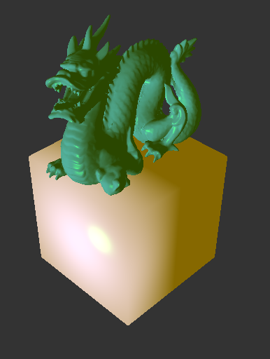
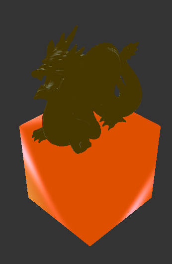
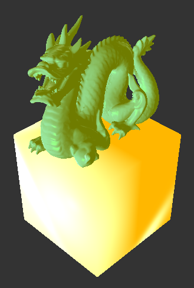

# Bootstrat OpenGL

## Summary
This shows my proficiency in creating lights from a engine that was created from scratch that did not set up a light.
This also shows my ability to add textures to objects such as planes.  

The lights seperately:

Light together:

## Buttons
> **Property**  | **Value**
> --------------|--------------------------------
> W             | Moves forward
> S             | Moves backward
> A             | Moves Left
> D             | Moves Right

### Where to go 

Go onto github and look at releases and download!
https://github.com/CaileyBianchini/Bootstrap/releases/tag/v1.0.0